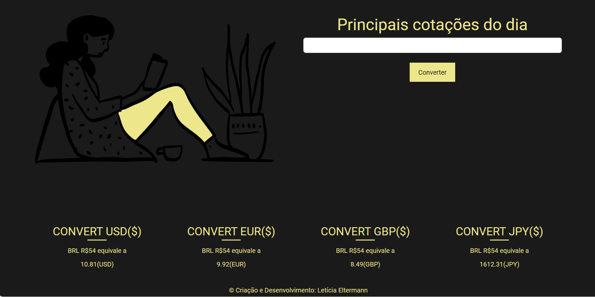

# Conversor de Moedas e Visualizador de Cotações

Este projeto consiste em uma aplicação web com duas funcionalidades principais: conversão de valores entre diferentes moedas e visualização das principais cotações do dia. Desenvolvido em PHP, HTML e CSS, oferece uma interface simples e intuitiva para usuários realizarem conversões monetárias e consultarem cotações atuais.

## Funcionalidades

- **Conversão de Moedas:** Permite aos usuários inserir um valor em Reais (BRL) para converter em várias outras moedas (USD, EUR, GBP, JPY, CAD) utilizando taxas de câmbio atualizadas.

- **Visualização de Cotações:** Exibe as principais cotações do dia para as moedas disponíveis, proporcionando uma visão geral das taxas de câmbio atuais.

## Tecnologias Utilizadas

- **PHP 8.1:** Linguagem de programação server-side utilizada para realizar requisições à API de taxas de câmbio e processar as conversões.

- **HTML:** Estrutura as páginas web.

- **CSS:** Estiliza as páginas, incluindo layouts responsivos que se adaptam a diferentes tamanhos de tela.

- **Bootstrap:** Biblioteca framework para web para construção de páginas responsivas.

- **Slim Framework:** Utilizado como modelo de design MVC para a aplicação.

- **API de Taxas de Câmbio:** Fornece as taxas de câmbio atualizadas utilizadas nas conversões e na visualização das cotações.

## Estrutura MVC

O padrão de design Model-View-Controller (MVC) é um padrão arquitetônico de software que separa uma aplicação em três componentes principais: Modelo, Visão e Controlador. Aqui está uma breve descrição de cada componente:

- **Modelo:** Representa os dados e a lógica de negócios de uma aplicação. Gerencia os dados da aplicação, processa as regras de negócios e responde a solicitações de informações de outros componentes.

- **Visão:** Exibe os dados do Modelo para o usuário e envia as entradas do usuário para o Controlador. Não interage diretamente com o Modelo.

- **Controlador:** Atua como intermediário entre o Modelo e a Visão. Lida com a entrada do usuário, atualiza o Modelo de acordo e atualiza a Visão para refletir as mudanças no Modelo.

Este padrão é útil para criar aplicações separando as responsabilidades do projeto, independentemente da plataforma, separando o acesso aos dados e as regras de negócios, a apresentação e a integração entre as camadas. Torna a aplicação mais fácil de manter e estender, pois as mudanças em um componente não exigem mudanças nos outros componentes.

## Configuração Necessária

- É necessário possuir um servidor PHP para rodar a aplicação, por exemplo, WAMP Server.
- Configurar o arquivo `.env` com suas credenciais e chave de API para a consulta de taxas de câmbio.

Exemplo `.env`:

MYSQL_DRIVER = seu_drive

MYSQL_HOST = localhost

MYSQL_PORT = 3306

MYSQL_DATABASE = data_teste

MYSQL_USER = root

MYSQL_PASSWORD =

BASE_CURRENCY = BRL

TARGET_CURRENCY = USD

BASE_URL = https://v6.exchangerate-api.com/v6/

API_KEY = sua_key

## Instalação

1. Faça o download do Composer para baixar as dependências do projeto: [Download Composer](https://getcomposer.org/download/)
2. Após instalar o Composer, entre no projeto e execute o comando: `composer install`.

## Como Usar

### 1. Conversão de Moedas:

- Abra a página de conversão de moedas.
- Insira o valor em Reais (BRL) que deseja converter.
- Clique no botão "Converter" para ver o valor convertido nas moedas disponíveis (USD, EUR, GBP, JPY, CAD).

### 2. Visualização de Cotações:

- Abra a página de cotações para ver as principais taxas de câmbio do dia.
- As cotações são exibidas em uma interface simples, mostrando quanto 1 Real (BRL) vale nas moedas disponíveis.
- Agora as consultas são feitas com um formulário informando o valor para ser convertido.
- Use os botões "Fazer conversão" para acessar rapidamente a ferramenta de conversão de moedas com a moeda selecionada.

## Desenvolvimento e Contribuições

- **Criação e Desenvolvimento:** Letícia Eltermann
- Contribuições são bem-vindas. Para contribuir, por favor, crie um fork do projeto, faça suas alterações e envie um pull request.

## Licença

Este projeto é distribuído sob a licença MIT.
